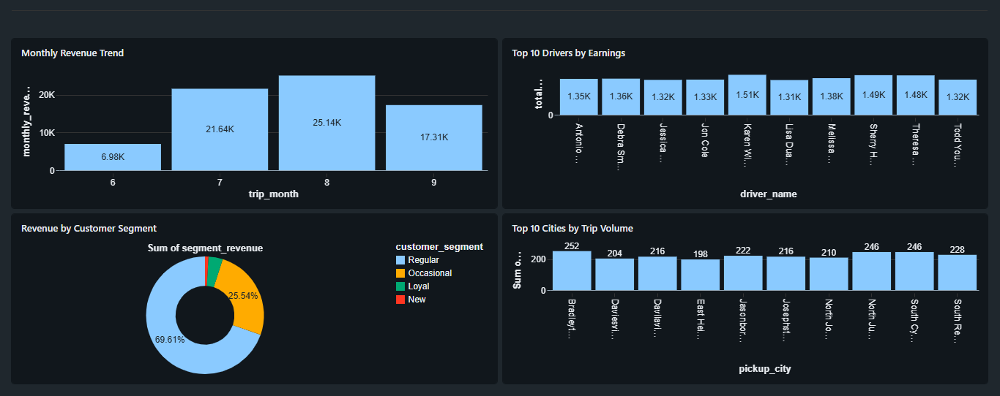
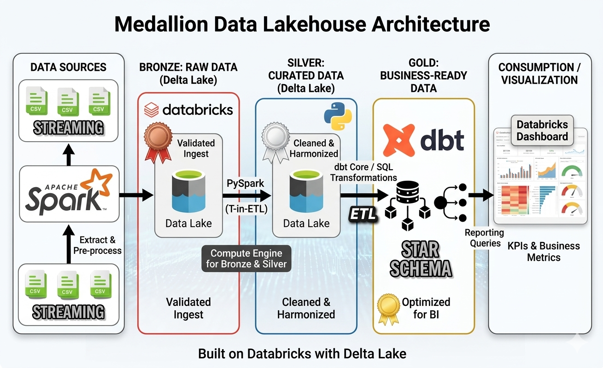

# 🚗 Uber Data Pipeline — PySpark + dbt + Databricks

End-to-end data engineering pipeline built on the 
Medallion Architecture (Bronze → Silver → Gold) using 
PySpark, dbt, and Databricks Unity Catalog.

---

## 📊 Dashboard


---

## 🏗️ Architecture

```
CSV Files (Source)
      ↓
Bronze Layer — PySpark Structured Streaming
pysparkdbt.bronze.* (6 Delta tables)
      ↓
Silver Layer — PySpark Transformations + Delta MERGE
pysparkdbt.silver.* (cleaned, deduped, upserted)
      ↓
dbt Incremental Model
silver.trips
      ↓
SCD Type 2 Snapshots
pysparkdbt.gold.dim* (full history preserved)
      ↓
Gold Layer — 4 Business KPI Models
pysparkdbt.gold.*
```

---

## 🛠️ Tech Stack

| Layer | Technology |
|---|---|
| Ingestion | PySpark Structured Streaming |
| Storage | Delta Lake, Databricks Unity Catalog |
| Transformation | PySpark, dbt |
| Orchestration | dbt Cloud |
| Historical Tracking | SCD Type 2 (dbt Snapshots) |
| Visualization | Databricks SQL Dashboard |

---

## 📁 Project Structure
```
├── bronze/
│   └── bronze_ingestion.py         # PySpark Streaming ingestion
├── silver/
│   └── silver_transformation.py    # PySpark transformations + upsert
├── utils/
│   └── custom_utils.py             # Reusable transformation class
├── dbt/
│   ├── models/
│   │   ├── silver/
│   │   │   └── trips.sql           # Incremental model
│   │   └── gold/
│   │       ├── fact_trip_revenue.sql
│   │       ├── kpi_driver_performance.sql
│   │       ├── kpi_revenue_analysis.sql
│   │       └── kpi_customer_segments.sql
│   ├── snapshots/
│   │   ├── fact.yml                # FactTrips SCD Type 2
│   │   └── SCDs.yml                # Dim tables SCD Type 2
│   └── macros/
│       └── generate_schema_name.sql
└── dashboard.PNG
```

---

## 📈 Business KPIs Built

| KPI | Model | Description |
|---|---|---|
| Revenue per KM | fact_trip_revenue | Pricing efficiency |
| Driver Tier Segmentation | kpi_driver_performance | Platinum/Gold/Silver/Bronze |
| Month-over-Month Growth | kpi_revenue_analysis | Revenue trends using LAG() |
| Payment Success Rate | kpi_revenue_analysis | Online vs offline splits |
| RFM Customer Segments | kpi_customer_segments | VIP/Loyal/Regular/Occasional/New |

---

## 🔄 Pipeline Flow

### Bronze Layer
- PySpark Structured Streaming reads CSV files
- `trigger(once=True)` for scheduled batch-style runs
- Writes to Delta tables in Unity Catalog
- Checkpoint-based incremental processing

### Silver Layer
- Entity-specific transformations per table
- Reusable `transformations` class in `custom_utils.py`
- Delta MERGE upsert pattern (idempotent writes)
- SCD Type 1 via MERGE condition on timestamp

### Gold Layer (dbt)
- Incremental model for trips with watermark filtering
- SCD Type 2 snapshots using timestamp strategy
- `dbt_valid_to = '9999-12-31'` for current records
- 4 business KPI models with window functions

---

## 🚀 How to Run

### Bronze Ingestion
```python
# Run bronze_ingestion.py in Databricks
# Reads from /Volumes/pysparkdbt/source/source_data/
# Writes to pysparkdbt.bronze.*
```

### Silver Transformation
```python
# Run silver_transformation.py in Databricks
# Reads from pysparkdbt.bronze.*
# Writes to pysparkdbt.silver.*
```

### dbt Models
```bash
dbt run        # run all models
dbt snapshot   # run SCD Type 2 snapshots
dbt test       # run data quality tests
```

---

## 👤 Author
**Mandar Mungekar**  
Data Engineer  
[GitHub](https://github.com/MandarM10)

